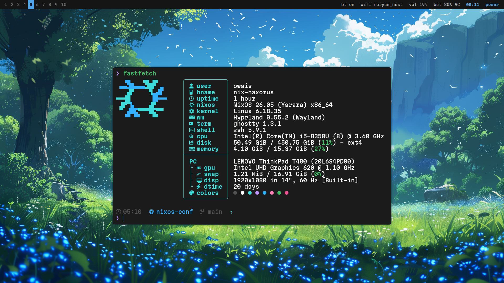

# dots & flakes

This [book](https://nix.desertthunder.dev) collects notes and guides for my
personal NixOS and dotfiles setup.

If you spot something broken or confusing, open an issue. Note that I tend
to keep files pretty long. grep & ripgrep are your friends.

For system administration and multi-machine setup details, see the
[NixOS](./docs/src/nixos.md) and [Guides](./docs/src/guides.md) docs.

Wallpapers are [here](./conf/modules/hypr/wallpapers/)

My neovim config as located in this [repo](https://github.com/desertthunder/nvim)

## Credits

This site was inspired by isabel's older dotfiles [book](https://dotfiles.isabelroses.com/)

## Migration Guides

For detailed migration procedures and inventory management, see the [Migration
Guide](./docs/src/guides.md).
